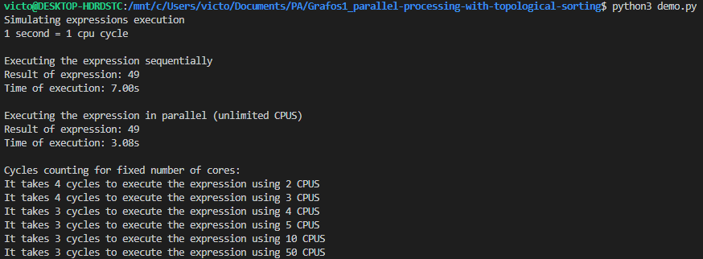
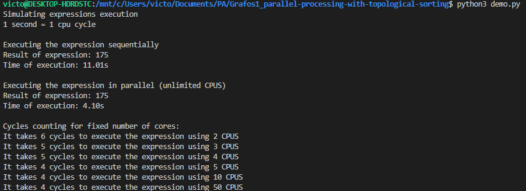

# Parallel Processing with Topological Sorting

**Número da Lista**: 1 <br>
**Conteúdo da Disciplina**: Grafos 1<br>

## Alunos
|Matrícula | Aluno |
| -- | -- |
| 16/0049733  |  Felipe Borges de Souza Chaves |
| 18/0055241  |  Victor Jorge da Silva Gonçalves |

## Sobre 
O objetivo do projeto é oferecer uma abordagem para o problema de distribuição de operações sobre um sistema de processamento paralelo. Dado um conjunto de operações a serem realizadas, muitas delas podem depender da execução prévia de outras operações também pertencentes a este conjunto. Tal coisa implica na não trivialidade da escolha da ordem de execução de tais tarefas, acrescido da complexidade que é distribuir tais operações sobre múltiplos núcleos de processamento.

O projeto utiliza da lógica de grafos, mapeando cada operação como um nó e aplicando um algoritmo de ordenação topológica que decidirá a ordem precisa das operações a serem executadas, trazendo uma utilização satisfatória dos recursos computacionais.

## Screenshots




## Instalação 
**Linguagem**: Python<br>
Necessário o [Python](https://www.python.org/about/gettingstarted/) em versão 3.6 ou superior.

## Uso 

Para simular a execução é necessário que sua expressão seja escrita através das funcoes:
```Python
attr_val(value) # Atribui um valor a um registrador
mult(value1, value2) # Multiplica value1 e value2
add(value1, value2) # Adiciona value1 e value2
sub(value1, value2) # Subtrai value2 de value1
div(value1, value2) # Divide value1 por value2
```

No arquivo [demo.py](demo.py) encontre a função _create_expression_ e monte sua expressão atribuindo-a à variável _expression_. Ex.:

> A expressão **(2+2) * (1-1)** seria escrita como:

```Python
def create_expression():
    """
    Create the expression here
    """

    expression = mult(add(attr_value(2), attr_value(2)), sub(attr_value(1), attr_value(1)))

    return expression
```

Uma vez escrita a expressão a ser executada, rode o comando:
```bash
$ python3 demo.py
```

Após isso, você verá na tela quantos ciclos essa expressão leva para ser executada em diversos cenários.

